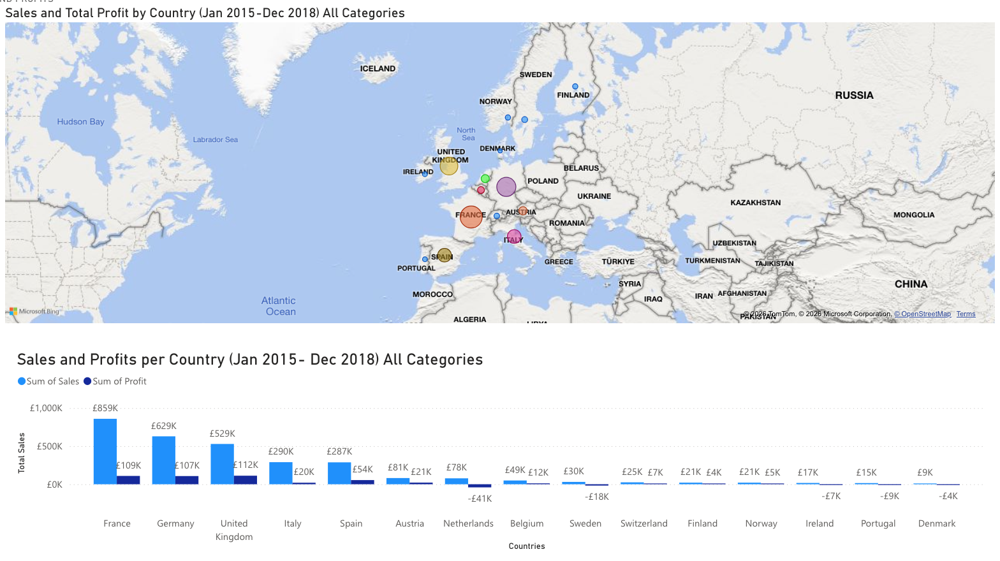
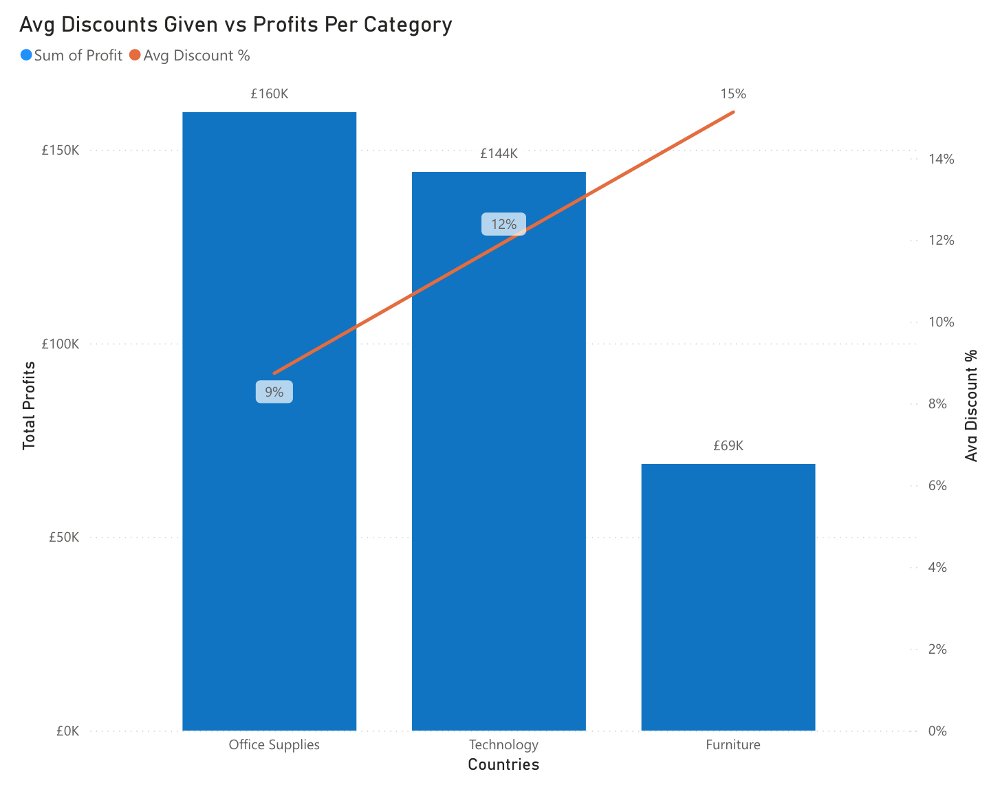
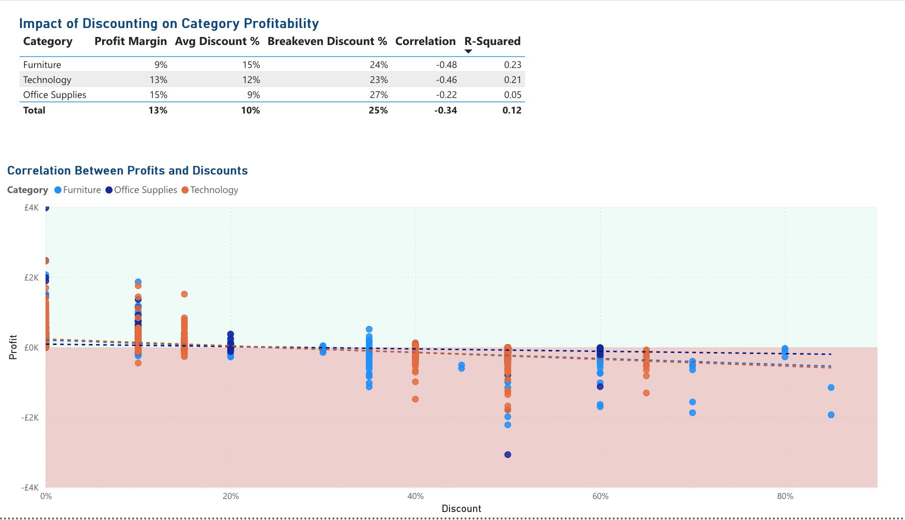
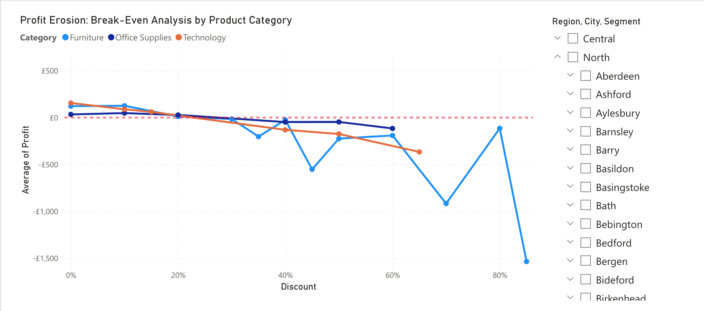
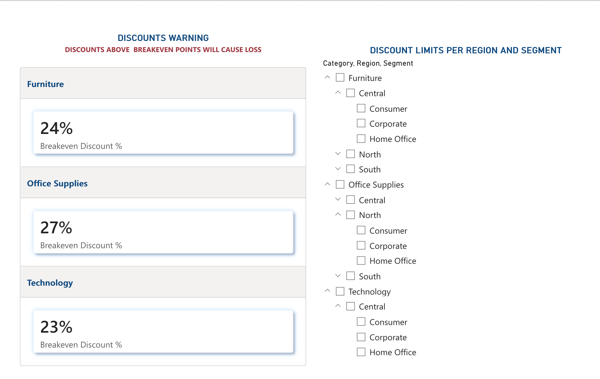

# DeepAnalysis

# Finding 'Break-even Points' in Pricing to Protect Profits
### Analysis via Power BI | EU Superstore Dataset

## 📊 Project Overview
This project investigates the impact of discount strategies on net profitability across a European retail dataset. By leveraging Power BI and DAX, the exact "tipping points" where discounts transition from promotional tools to value-destructive losses were identified. These insights facilitate high-level forecasting and data-driven pricing strategies.

### Situation
The dataset contains over 10,000 transactional logs from a European retail entity (France, Germany, UK) between 2015 and 2018. Upon initial review, a concerning trend was identified: significant financial losses were frequently occurring alongside high-volume discounts in the Furniture and Technology sectors.

### Task
Recognising that these losses were unsustainable, the initiative was taken to identify the Break-even Point—the exact discount threshold where net profit hits zero. The goal was to provide a data-backed roadmap to prevent "margin leakage" and help the business distinguish between a "good sale" and a "loss-making sale."

### Action
The following custom DAX measures were developed to drive the analysis:

*   **Total Profit & Profit Margin %:** To assess overall financial health.
*   **Average Discount %:** To normalize discount tracking across variable order sizes.
*   **Correlation and R2:** These metrics were applied to validate how discounting strategy impacts the bottom line. While Correlation shows the direction of the relationship, R-Squared quantifies exactly how much of our profit fluctuation is driven by discounts. This helps distinguish between successful promotions and margin erosion.
*   **Breakeven Discount %:** A sophisticated measure using linear interpolation to find the exact point where the profit curve intersects the zero-axis.
*   **Profit Colour:** A conditional formatting logic to visually highlight losses in Red, providing immediate "Danger Zone" recognition.

---

  

  

  

  

  

  

## 📊  Interact with the reports
*   🔗 **[Interact with the reports about discounts here](https://sites.google.com/view/nadia-online/projects/deep-analysis)**
*   **[Download the .pbix file from here](EUSuperstore.pbix)**

 
## 📖 How to Read the "Sweet Spot" Chart
*   **The Horizon (Zero Line):** The solid black line represents £0 Profit.
    *   **The Profit Zone:** Anything above this line is "money in the bank."
    *   **The Loss Zone:** Anything below this line means the business is paying to sell the product.
*   **The Intersection (The Sweet Spot):** The exact point where the category line crosses the Horizon is your maximum safe discount. If the line crosses at 24%, any discount at 25% or higher is a "red" sale.
*   **The Slope:** The steeper the line (like in Furniture), the more "fragile" that category is. A small 5% change in discount can lead to a massive swing in profit.

### 💡 How to use the Slicers
Use the **Region** and **Segment** slicers to see your local "Sweet Spot." You’ll notice that while the general break-even for Technology is high, certain regions have much tighter margins. This helps managers set localised discount policies based on regional competitors or customer types.

## 🛠️ Technical Challenges Overcome
*   **Environment Constraints:** Navigating the specific UI limitations of the Power BI Web Version.
*   **Data Standardisation:** Resolved initial data discrepancies by adjusting 'Locale' settings to align time zones and currency formatting.
*   **Visual Calibration:** Fine-tuned X and Y axes to ensure a continuous scale that accurately represented the relationship between percentage and currency.

## ✅ Result
*   **Interactive Geographic Map:** Integrated a map visual to show profit distribution across Europe, allowing decision-makers to spot struggling cities at a glance.
*   **Threshold Discovery:** Identified that **Furniture** has the lowest discount tolerance (breaking even at ~24%), whereas **Office Supplies** remains resilient at higher tiers.
*   **Risk Mitigation:** The "Profit Colour" implementation allowed stakeholders to instantly identify unprofitable regions.
*   **Strategic Foundation:** Established a baseline for future Forecasting Models to predict the financial impact of seasonal sales before launch.

## 🧰 Technical Stack
*   **Tool:** Power BI (Web/Desktop)
*   **Language:** DAX (Data Analysis Expressions)
*   **Key Features:** Conditional Formatting, Linear Interpolation, Locale Configuration.
*   **AI Validation:** Used Google Notebook LM, DeepSeek, and Gemini to validate findings and logic.

## 📈 Future Enhancements
*   **Key Influencer Analysis:** Use AI-driven visuals to identify primary drivers behind profit fluctuations, such as Seasonality or Shipping Costs.
*   **Forecasting:** Develop predictive models to simulate how shifts in supply chain costs move the break-even thresholds.

## ⚖️ Ethics & Compliance
*   **Data Privacy:** This project uses a public dataset. No GDPR regulations were breached during the analysis.
*   **Transparency:** AI tools were used for logic validation and documentation assistance; all data modeling and visual design were performed manually.
